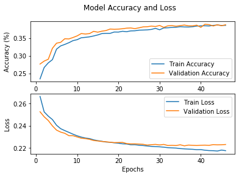

FM Sound Match Experiment
=========================

In progress.

This is where a jupyter notebook of the experiment, as well as links to
download the code and data for this experiment will go.

.. code:: ipython3

    # Required imports for following code
    import spiegel
    import numpy as np
    import tensorflow as tf

.. _dataset_generation:

Dataset Generation
------------------

First step is to generate and save datasets for training and validating deep
learning models. Additionally, we create a small audio dataset for
evaluation.

Here, we load the Dexed VST, and set the note length and render length to be one second.
For this experiment we aren’t worried about the release of the sound,
but you can set the render length longer than the note length to capture
the release portion of a signal. Synthesizer parameters are loaded from
a JSON file that describes all the overridden parameters and their
values.

.. code:: ipython3

    synth = spiegel.synth.SynthVST("/Library/Audio/Plug-Ins/VST/Dexed.vst",
                                   note_length_secs=1.0, render_length_secs=1.0)
    synth.load_state("./synth_params/dexed_simple_fm.json")

MFCC Dataset
^^^^^^^^^^^^

Generate training and testing dataset using Mel-frequency Cepstral
Coefficients feature extraction. The DatasetGenerator class works by
generating random patches from the synthesizer, then running audio
feature extraction on the resulting sound, and then saving the audio
features and parameter values. Audio features and parameter values are saved in
seperate .npy files.

We set the `time_major` argument to `True` so that the orientation of the output
is (time_slices, features), as opposed to (features, time_slices) which
is default. This is how TensorFlow models expect the data to be
oriented.

Normalization settings used for the training dataset are saved as a .pkl file.
These settings are used to ensure future data is normalized in the same way.

The total size of this dataset is about 140MB.

.. code:: ipython3

    # Mel-frequency Cepstral Coefficients audio feature extractor.
    features = spiegel.features.MFCC(num_mfccs=13, time_major=True, hop_size=1024)

    # Setup generator for MFCC output and generate 50000 training examples and 10000 testing examples
    generator = spiegel.DatasetGenerator(synth, features,
                                         output_folder="./data_simple_FM_mfcc",
                                         normalize=True)
    generator.generate(50000, file_prefix="train_")
    generator.generate(10000, file_prefix="test_")
    generator.save_normalizers('normalizers.pkl')

STFT Dataset
^^^^^^^^^^^^

Generate training and testing dataset using the magnitude of the STFT.
This dataset will be used to train the convolutional neural network.

The total size of the resulting dataset is about 10.8GB.

.. code:: ipython3

    # Magnitude STFT ouptut feature extraction
    features = spiegel.features.STFT(fft_size=512, hop_size=256, output='magnitude', time_major=True)

    # Setup generator and create dataset
    generator = spiegel.DatasetGenerator(synth, features, output_folder="./data_simple_FM_stft", normalize=True)
    generator.generate(50000, file_prefix="train_")
    generator.generate(10000, file_prefix="test_")
    generator.save_normalizers('noramlizers.pkl')

Evaluation Dataset
^^^^^^^^^^^^^^^^^^

Create an audio set for evaluation. We set the save_audio argument to
True in the DatasetGenerator constructor so that audio WAV files are
saved for this set.

.. code:: ipython3

    eval_generator = spiegel.DatasetGenerator(synth, features,
                                              output_folder='./evaluation',
                                              save_audio=True)
    eval_generator.generate(25)

Train Deep Learning Models
--------------------------

Now that we have created our datasets, we can train a set of deep learning models
using that data. The input training data for each
model is the audio features extracted for a synth patch, and the ground
truth data is the parameter values for that synth patch. Each trained
model is saved in the saved_models folder.

All deep learning models used here inherit from :ref:`TFEstimatorBase <tf_estimator_base>`

Multi-Layer Perceptron
^^^^^^^^^^^^^^^^^^^^^^

Her we train a relatively basic fully connected MLP model. The audio
features, which are in *numpy* arrays with time slices, need to be
flattened prior to being fed into the network.

.. code:: ipython3

  trainFeatures = np.load('./data_simple_FM_mfcc/train_features.npy')
  trainParams = np.load('./data_simple_FM_mfcc/train_patches.npy')
  testFeatures = np.load('./data_simple_FM_mfcc/test_features.npy')
  testParams = np.load('./data_simple_FM_mfcc/test_patches.npy')

  # Flatten feature time slices
  trainFeatures = trainFeatures.reshape(trainFeatures.shape[0], -1)
  testFeatures = testFeatures.reshape(testFeatures.shape[0], -1)

  # Setup callbacks for trainings
  logger = spiegel.estimator.TFEpochLogger()
  earlyStopping = tf.keras.callbacks.EarlyStopping(monitor='val_loss', patience=10)

  # Instantiate MLP Model with the input shape, output shape, and callbacks
  mlp = spiegel.estimator.MLP((trainFeatures.shape[-1],),
                              trainParams.shape[-1],
                              callbacks=[logger, earlyStopping])

  # Add training and validation data
  mlp.add_training_data(trainFeatures, trainParams)
  mlp.add_testing_data(testFeatures, testParams)
  mlp.model.summary()

.. parsed-literal::

  Model: "sequential"
  _________________________________________________________________
  Layer (type)                 Output Shape              Param #
  =================================================================
  dense (Dense)                (None, 50)                28650
  _________________________________________________________________
  dense_1 (Dense)              (None, 40)                2040
  _________________________________________________________________
  dense_2 (Dense)              (None, 30)                1230
  _________________________________________________________________
  dense_3 (Dense)              (None, 9)                 279
  =================================================================
  Total params: 32,199
  Trainable params: 32,199
  Non-trainable params: 0
  _________________________________________________________________

.. code:: ipython3

  mlp.fit(epochs=100)
  mlp.save_model('./saved_models/simple_fm_mlp.h5')
  logger.plot()

.. image:: images/mlp_training.png

Long short-term memory (LSTM)
^^^^^^^^^^^^^^^^^^^^^^^^^^^^^

.. code:: ipython3

  trainFeatures = np.load('./data_simple_FM_mfcc/train_features.npy')
  trainParams = np.load('./data_simple_FM_mfcc/train_patches.npy')
  testFeatures = np.load('./data_simple_FM_mfcc/test_features.npy')
  testParams = np.load('./data_simple_FM_mfcc/test_patches.npy')

  # Setup callbacks for trainings
  logger = spiegel.estimator.TFEpochLogger()
  earlyStopping = tf.keras.callbacks.EarlyStopping(monitor='val_loss', patience=10)

  # Instantiate LSTM Model with the input shape, output shape, and callbacks
  lstm = spiegel.estimator.LSTM(trainFeatures.shape[-2:],
                                trainParams.shape[-1],
                                callbacks=[logger, earlyStopping])

  lstm.add_training_data(trainFeatures, trainParams)
  lstm.add_testing_data(testFeatures, testParams)
  lstm.model.summary()

.. parsed-literal::

  Model: "sequential_1"
  _________________________________________________________________
  Layer (type)                 Output Shape              Param #
  =================================================================
  lstm (LSTM)                  (None, 44, 100)           45600
  _________________________________________________________________
  lstm_1 (LSTM)                (None, 44, 100)           80400
  _________________________________________________________________
  lstm_2 (LSTM)                (None, 100)               80400
  _________________________________________________________________
  dropout (Dropout)            (None, 100)               0
  _________________________________________________________________
  dense_4 (Dense)              (None, 9)                 909
  =================================================================
  Total params: 207,309
  Trainable params: 207,309
  Non-trainable params: 0
  _________________________________________________________________

.. code:: ipython3

  lstm.fit(epochs=100)
  lstm.save_model('./saved_models/simple_fm_lstm.h5')
  logger.plot()

Bi-directional long short-term memory with highway layers (LSTM++)
^^^^^^^^^^^^^^^^^^^^^^^^^^^^^^^^^^^^^^^^^^^^^^^^^^^^^^^^^^^^^^^^^^

.. code:: ipython3

  # Setup callbacks for trainings
  logger = spiegel.estimator.TFEpochLogger()
  earlyStopping = tf.keras.callbacks.EarlyStopping(monitor='val_loss', patience=10)

  # Instantiate LSTM++ Model with the input shape, output shape, and callbacks
  bi_lstm = spiegel.estimator.HwyBLSTM(trainFeatures.shape[-2:],
                                       trainParams.shape[-1],
                                       callbacks=[logger, earlyStopping],
                                       highway_layers=6)

  bi_lstm.add_training_data(trainFeatures, trainParams)
  bi_lstm.add_testing_data(testFeatures, testParams)
  bi_lstm.model.summary()

.. parsed-literal::

  Model: "sequential_2"
  _________________________________________________________________
  Layer (type)                 Output Shape              Param #
  =================================================================
  bidirectional (Bidirectional (None, 256)               145408
  _________________________________________________________________
  dropout_1 (Dropout)          (None, 256)               0
  _________________________________________________________________
  dense_5 (Dense)              (None, 64)                16448
  _________________________________________________________________
  highway_layer (HighwayLayer) (None, 64)                8320
  _________________________________________________________________
  highway_layer_1 (HighwayLaye (None, 64)                8320
  _________________________________________________________________
  highway_layer_2 (HighwayLaye (None, 64)                8320
  _________________________________________________________________
  highway_layer_3 (HighwayLaye (None, 64)                8320
  _________________________________________________________________
  highway_layer_4 (HighwayLaye (None, 64)                8320
  _________________________________________________________________
  highway_layer_5 (HighwayLaye (None, 64)                8320
  _________________________________________________________________
  dense_6 (Dense)              (None, 9)                 585
  =================================================================
  Total params: 212,361
  Trainable params: 212,361
  Non-trainable params: 0
  _________________________________________________________________

.. code:: ipython3

  bi_lstm.fit(epochs=100)
  bi_lstm.save_model('./saved_models/simple_fm_bi_lstm.h5')
  logger.plot()

.. image:: images/blstm_training.png

Convolutional Neural Network (CNN)
^^^^^^^^^^^^^^^^^^^^^^^^^^^^^^^^^^

.. code:: ipython3

  trainFeatures = np.load('./data_simple_FM_stft/train_features.npy')
  trainParams = np.load('./data_simple_FM_stft/train_patches.npy')
  testFeatures = np.load('./data_simple_FM_stft/test_features.npy')
  testParams = np.load('./data_simple_FM_stft/test_patches.npy')

  # Create "STFT Images" with one channel for 2D CNN
  trainFeatures = trainFeatures.reshape(trainFeatures.shape[0], trainFeatures.shape[1], trainFeatures.shape[2], 1)
  testFeatures = testFeatures.reshape(testFeatures.shape[0], testFeatures.shape[1], testFeatures.shape[2], 1)

.. code:: ipython3

  # Setup callbacks for trainings
  logger = spiegel.estimator.TFEpochLogger()
  earlyStopping = tf.keras.callbacks.EarlyStopping(monitor='val_loss', patience=10)

  # Instantiate Conv6 Model with the input shape, output shape, and callbacks
  cnn = spiegel.estimator.Conv6(trainFeatures.shape[1:],
                                trainParams.shape[-1],
                                callbacks=[logger, earlyStopping])

  cnn.add_training_data(trainFeatures, trainParams)
  cnn.add_testing_data(testFeatures, testParams)
  cnn.model.summary()

.. parsed-literal::

  Model: "sequential_3"
  _________________________________________________________________
  Layer (type)                 Output Shape              Param #
  =================================================================
  conv2d (Conv2D)              (None, 87, 128, 32)       320
  _________________________________________________________________
  conv2d_1 (Conv2D)            (None, 43, 63, 71)        20519
  _________________________________________________________________
  conv2d_2 (Conv2D)            (None, 21, 20, 128)       109184
  _________________________________________________________________
  conv2d_3 (Conv2D)            (None, 10, 9, 128)        147584
  _________________________________________________________________
  conv2d_4 (Conv2D)            (None, 4, 4, 128)         147584
  _________________________________________________________________
  conv2d_5 (Conv2D)            (None, 2, 1, 128)         147584
  _________________________________________________________________
  dropout_2 (Dropout)          (None, 2, 1, 128)         0
  _________________________________________________________________
  flatten (Flatten)            (None, 256)               0
  _________________________________________________________________
  dense_7 (Dense)              (None, 9)                 2313
  =================================================================
  Total params: 575,088
  Trainable params: 575,088
  Non-trainable params: 0
  _________________________________________________________________

.. code:: ipython3

  cnn.fit(epochs=100)
  cnn.save_model('./saved_models/simple_fm_cnn.h5')
  logger.plot()

.. image:: images/cnn_training.png

Sound Match Deep Learning Models
--------------------------------

Now we can perform sound matching of the evaluation target set using the
trained deep learning models and save the resulting audio files to disk
for evaluation

.. code:: ipython3

    # Load all saved models
    mlp = spiegel.estimator.TFEstimatorBase.load('./saved_models/simple_fm_mlp.h5')
    lstm = spiegel.estimator.TFEstimatorBase.load('./saved_models/simple_fm_lstm.h5')
    bi_lstm = spiegel.estimator.TFEstimatorBase.load('./saved_models/simple_fm_bi_lstm.h5')
    cnn = spiegel.estimator.TFEstimatorBase.load('./saved_models/simple_fm_cnn.h5')

.. code:: ipython3

    # Load synth with overriden params
    synth = spiegel.synth.SynthVST("/Library/Audio/Plug-Ins/VST/Dexed.vst",
                                   note_length_secs=1.0, render_length_secs=1.0)
    synth.load_state("./synth_params/dexed_simple_fm.json")

Setup all the feature extractors to provide the correct input data for
each model based on how it was trained. Also use the same data
normalizers that were setup when initially creating each dataset.

.. code:: ipython3

    # MLP feature extractor with a modifying function that flattens the time slice arrays at the end of the feature
    # extraction pipeline
    mlp_extractor = spiegel.features.MFCC(num_mfccs=13, time_major=True, hop_size=1024, normalize=True)
    mlp_extractor.load_normalizers('./data_simple_fm_mfcc/normalizers.pkl')
    mlp_extractor.add_modifier(lambda data : data.flatten(), type='output')

    # LSTM & LSTM++ feature extractor -- time series of MFCC frames
    lstm_extractor = spiegel.features.MFCC(num_mfccs=13, time_major=True, hop_size=1024, normalize=True)
    lstm_extractor.load_normalizers('./data_simple_fm_mfcc/normalizers.pkl')

    # CNN feature extractor uses magnitude output from STFT and then modifies the output array into a 3D array for the
    # 2D convolutional network becuase it is expecting an image with a single channel (ie grayscale).
    cnn_extractor = spiegel.features.MagnitudeSTFT(fft_size=512, hop_size=256, time_major=True, normalize=True)
    cnn_extractor.load_normalizers('./data_simple_fm_stft/normalizers.pkl')
    cnn_extractor.add_modifier(lambda data : data.reshape(data.shape[0], data.shape[1], 1), type='output')

SoundMatch is a class designed to help run sound matches for a
synthesizer and a specific estimator type. Each SoundMatch object
requires a synthesizer to use to generate sounds, an estimator object,
and optionally an audio feature extractor object. If an audio feature
object is provided, that will be used to extract features from incoming
audio prior to running estimation. This is required for these deep
learning models, but some estimators can handle raw audio, such as the
genetic estimators.

.. code:: ipython3

    mlp_matcher = spiegel.SoundMatch(synth, mlp, mlp_extractor)
    lstm_matcher = spiegel.SoundMatch(synth, lstm, lstm_extractor)
    bi_lstm_matcher = spiegel.SoundMatch(synth, bi_lstm, lstm_extractor)
    cnn_matcher = spiegel.SoundMatch(synth, cnn, cnn_extractor)

Load in the folder of evaluation audio samples and perform sound
matching on each one with each estimation model. AudioBuffer.load_folder
performs a natural sort based on the file names of the audio contained
in the specified folder, so we can save each prediction with a
corresponding integer number and be assured that the ordering will match
up when we get to evaluation.

.. code:: ipython3

    targets = spiegel.AudioBuffer.load_folder('./evaluation/audio')

    for i in range(len(targets)):
        audio = mlp_matcher.match(targets[i])
        audio.save('./evaluation/mlp/mlp_prediction_%s.wav' % i)

        audio = lstm_matcher.match(targets[i])
        audio.save('./evaluation/lstm/lstm_prediction_%s.wav' % i)

        audio = bi_lstm_matcher.match(targets[i])
        audio.save('./evaluation/bi_lstm/bi_lstm_prediction_%s.wav' % i)

        audio = cnn_matcher.match(targets[i])
        audio.save('./evaluation/cnn/cnn_prediction_%s.wav' % i)

Sound Match Genetic Algorithm Estimators
----------------------------------------

Now we perform sound matching of the evaluation target set using the
two genetic algorithm based approaches and save the resulting audio
files to disk for evaluation.

.. code:: ipython3

   # Load synth with overridden params
   synth = spiegel.synth.SynthVST("/Library/Audio/Plug-Ins/VST/Dexed.vst",
                                  note_length_secs=1.0, render_length_secs=1.0)
   synth.load_state("./synth_params/dexed_simple_fm.json")

Basic Genetic Algorithm
^^^^^^^^^^^^^^^^^^^^^^^

Setup the feature extractor for the basic single-objective genetic
algorithm. It uses a 13-band MFCC, which is calculated on every new
individual in the population. The error between an inididual and the
target audio sound is used the evaluate the fitness of each individual.

.. code:: ipython3

   # MFCC features
   ga_extractor = spiegel.features.MFCC(num_mfccs=13, hop_size=1024)

   # Basic Genetic Algorithm estimator
   ga = spiegel.estimator.BasicGA(synth, ga_extractor, pop_size=300, ngen=100)

   # Sound matching helper class
   ga_matcher = spiegel.SoundMatch(synth, ga)

Non-dominated sorting genetic algorithm III (NSGA III)
^^^^^^^^^^^^^^^^^^^^^^^^^^^^^^^^^^^^^^^^^^^^^^^^^^^^^^

Setup the feature extractors for the multi-objective genetic algorithm.
Each extractor is used for one of the GA objectives, so in this instance
there are 3 objectives: MFCC, Spectral Summarized, and the FFT.

.. code:: ipython3

   # Feature extractors for Multi-Objective GA
   nsga_extractors = [spiegel.features.MFCC(num_mfccs=13, hop_size=1024),
                      spiegel.features.SpectralSummarized(hop_size=1024),
                      spiegel.features.FFT(output='magnitude')]

   # NSGA3 Multi-Objective Genetic Algorithm
   nsga = spiegel.estimator.NSGA3(synth, nsga_extractors)

   # Sound matching helper class
   nsga_matcher = spiegel.SoundMatch(synth, nsga)

Sound Matching
^^^^^^^^^^^^^^

Load in the folder of evaluation audio samples and perform sound
matching on each one using both genetic algorithms. This may take
several hours to run on all 25 sounds.

.. code:: ipython3

   targets = spiegel.AudioBuffer.load_folder('./evaluation/audio')

   for i in range(len(targets)):
       audio = ga_matcher.match(targets[i])
       audio.save('./evaluation/ga/ga_predicition_%s.wav' % i)

       audio = nsga_matcher.match(targets[i])
       audio.save('./evaluation/nsga/nsga_prediction_%s.wav' % i)

Evaluation
----------

Finally, we evaluate the results of sound matching from both the deep
learning and genetic algorithms tested.

The MFCCEval class is used to perform an objective evaluation of each audio file generated. This is
carried out by measuring error metrics between the MFCCs from the target
sounds and the results from sound matching.

The results of this evaluation are saved in a JSON file which summarizes
the results for each estimator.

Histogram plots are also used to show the distribution of results
produced by each estimator. Histogram plots show the mean absolute error
of the sound matched results from each estimator.

.. code:: ipython3

  # Load the sound targets used for sound matching
  targets = spiegel.AudioBuffer.load_folder('./evaluation/audio')

  # Load all the estimations of the sound targets made by each estimator
  estimations = [spiegel.AudioBuffer.load_folder('./evaluation/mlp'),
                 spiegel.AudioBuffer.load_folder('./evaluation/lstm'),
                 spiegel.AudioBuffer.load_folder('./evaluation/bi_lstm'),
                 spiegel.AudioBuffer.load_folder('./evaluation/cnn'),
                 spiegel.AudioBuffer.load_folder('./evaluation/ga'),
                 spiegel.AudioBuffer.load_folder('./evaluation/nsga')]

  # Evaluate the results and save to JSON file
  evaluation = spiegel.evaluation.MFCCEval(targets, estimations)
  evaluation.evaluate()
  evaluation.save_stats_json('./evaluation/evaluation_stats.json')

MLP Histogram
^^^^^^^^^^^^^

.. code:: ipython3

  bins = np.arange(0, 40, 2.5)
  evaluation.plot_hist([0], 'mean_abs_error', bins)

.. image:: images/mlp_hist.png

LSTM Histogram
^^^^^^^^^^^^^^

.. code:: ipython3

  evaluation.plot_hist([1], 'mean_abs_error', bins)

.. image:: images/lstm_hist.png

LSTM++ Histogram
^^^^^^^^^^^^^^^^

.. code:: ipython3

  evaluation.plot_hist([2], 'mean_abs_error', bins)

.. image:: images/blstm_hist.png

CNN Histogram
^^^^^^^^^^^^^

.. code:: ipython3

  evaluation.plot_hist([3], 'mean_abs_error', bins)

.. image:: images/cnn_hist.png

GA Histogram
^^^^^^^^^^^^

.. code:: ipython3

  evaluation.plot_hist([4], 'mean_abs_error', bins)

.. image:: images/ga_hist.png

NSGA III Histogram
^^^^^^^^^^^^^^^^^^

.. code:: ipython3

  evaluation.plot_hist([5], 'mean_abs_error', bins)

.. image:: images/nsga_hist.png
