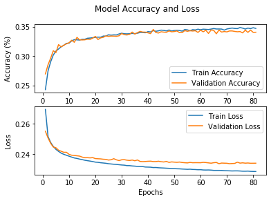
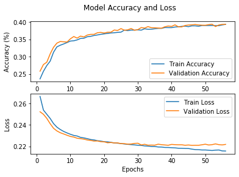
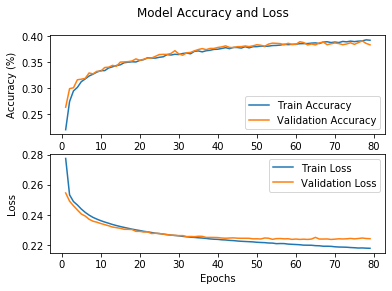
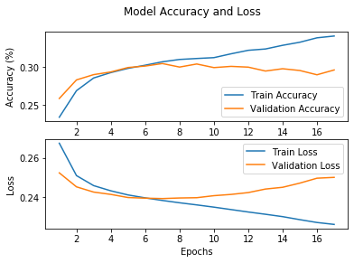

Train Deep Learning Models
--------------------------

Now that we have created our datasets, we can train a set of deep learning models
using that data. The input training data for each
model is the audio features extracted for a synth patch, and the ground
truth data is the parameter values for that synth patch. Each trained
model is saved in the saved_models folder.

All deep learning models used here inherit from :ref:`TFEstimatorBase <tf_estimator_base>`

Multi-Layer Perceptron
^^^^^^^^^^^^^^^^^^^^^^

Her we train a relatively basic fully connected MLP model. The audio
features, which are in *numpy* arrays with time slices, need to be
flattened prior to being fed into the network.

.. code:: ipython3

    import spiegel
    import numpy as np
    import tensorflow as tf

.. code:: ipython3

  trainFeatures = np.load('./data_simple_FM_mfcc/train_features.npy')
  trainParams = np.load('./data_simple_FM_mfcc/train_patches.npy')
  testFeatures = np.load('./data_simple_FM_mfcc/test_features.npy')
  testParams = np.load('./data_simple_FM_mfcc/test_patches.npy')

  # Flatten feature time slices
  trainFeatures = trainFeatures.reshape(trainFeatures.shape[0], -1)
  testFeatures = testFeatures.reshape(testFeatures.shape[0], -1)

  # Setup callbacks for trainings
  logger = spiegel.estimator.TFEpochLogger()
  earlyStopping = tf.keras.callbacks.EarlyStopping(monitor='val_loss', patience=10)

  # Instantiate MLP Model with the input shape, output shape, and callbacks
  mlp = spiegel.estimator.MLP((trainFeatures.shape[-1],),
                              trainParams.shape[-1],
                              callbacks=[logger, earlyStopping])

  # Add training and validation data
  mlp.add_training_data(trainFeatures, trainParams)
  mlp.add_testing_data(testFeatures, testParams)
  mlp.model.summary()

.. parsed-literal::

  Model: "sequential"
  _________________________________________________________________
  Layer (type)                 Output Shape              Param #
  =================================================================
  dense (Dense)                (None, 50)                28650
  _________________________________________________________________
  dense_1 (Dense)              (None, 40)                2040
  _________________________________________________________________
  dense_2 (Dense)              (None, 30)                1230
  _________________________________________________________________
  dense_3 (Dense)              (None, 9)                 279
  =================================================================
  Total params: 32,199
  Trainable params: 32,199
  Non-trainable params: 0
  _________________________________________________________________

.. code:: ipython3

  mlp.fit(epochs=100)
  mlp.save_model('./saved_models/simple_fm_mlp.h5')
  logger.plot()

Long short-term memory (LSTM)
^^^^^^^^^^^^^^^^^^^^^^^^^^^^^

.. code:: ipython3

  trainFeatures = np.load('./data_simple_FM_mfcc/train_features.npy')
  trainParams = np.load('./data_simple_FM_mfcc/train_patches.npy')
  testFeatures = np.load('./data_simple_FM_mfcc/test_features.npy')
  testParams = np.load('./data_simple_FM_mfcc/test_patches.npy')

  # Setup callbacks for trainings
  logger = spiegel.estimator.TFEpochLogger()
  earlyStopping = tf.keras.callbacks.EarlyStopping(monitor='val_loss', patience=10)

  # Instantiate LSTM Model with the input shape, output shape, and callbacks
  lstm = spiegel.estimator.LSTM(trainFeatures.shape[-2:],
                                trainParams.shape[-1],
                                callbacks=[logger, earlyStopping])

  lstm.add_training_data(trainFeatures, trainParams)
  lstm.add_testing_data(testFeatures, testParams)
  lstm.model.summary()

.. parsed-literal::

  Model: "sequential_1"
  _________________________________________________________________
  Layer (type)                 Output Shape              Param #
  =================================================================
  lstm (LSTM)                  (None, 44, 100)           45600
  _________________________________________________________________
  lstm_1 (LSTM)                (None, 44, 100)           80400
  _________________________________________________________________
  lstm_2 (LSTM)                (None, 100)               80400
  _________________________________________________________________
  dropout (Dropout)            (None, 100)               0
  _________________________________________________________________
  dense_4 (Dense)              (None, 9)                 909
  =================================================================
  Total params: 207,309
  Trainable params: 207,309
  Non-trainable params: 0
  _________________________________________________________________

.. code:: ipython3

  lstm.fit(epochs=100)
  lstm.save_model('./saved_models/simple_fm_lstm.h5')
  logger.plot()

Bi-directional long short-term memory with highway layers (LSTM++)
^^^^^^^^^^^^^^^^^^^^^^^^^^^^^^^^^^^^^^^^^^^^^^^^^^^^^^^^^^^^^^^^^^

.. code:: ipython3

  # Setup callbacks for trainings
  logger = spiegel.estimator.TFEpochLogger()
  earlyStopping = tf.keras.callbacks.EarlyStopping(monitor='val_loss', patience=10)

  # Instantiate LSTM++ Model with the input shape, output shape, and callbacks
  bi_lstm = spiegel.estimator.HwyBLSTM(trainFeatures.shape[-2:],
                                       trainParams.shape[-1],
                                       callbacks=[logger, earlyStopping],
                                       highway_layers=6)

  bi_lstm.add_training_data(trainFeatures, trainParams)
  bi_lstm.add_testing_data(testFeatures, testParams)
  bi_lstm.model.summary()

.. parsed-literal::

  Model: "sequential_2"
  _________________________________________________________________
  Layer (type)                 Output Shape              Param #
  =================================================================
  bidirectional (Bidirectional (None, 256)               145408
  _________________________________________________________________
  dropout_1 (Dropout)          (None, 256)               0
  _________________________________________________________________
  dense_5 (Dense)              (None, 64)                16448
  _________________________________________________________________
  highway_layer (HighwayLayer) (None, 64)                8320
  _________________________________________________________________
  highway_layer_1 (HighwayLaye (None, 64)                8320
  _________________________________________________________________
  highway_layer_2 (HighwayLaye (None, 64)                8320
  _________________________________________________________________
  highway_layer_3 (HighwayLaye (None, 64)                8320
  _________________________________________________________________
  highway_layer_4 (HighwayLaye (None, 64)                8320
  _________________________________________________________________
  highway_layer_5 (HighwayLaye (None, 64)                8320
  _________________________________________________________________
  dense_6 (Dense)              (None, 9)                 585
  =================================================================
  Total params: 212,361
  Trainable params: 212,361
  Non-trainable params: 0
  _________________________________________________________________

.. code:: ipython3

  bi_lstm.fit(epochs=100)
  bi_lstm.save_model('./saved_models/simple_fm_bi_lstm.h5')
  logger.plot()

Convolutional Neural Network (CNN)
^^^^^^^^^^^^^^^^^^^^^^^^^^^^^^^^^^

.. code:: ipython3

  trainFeatures = np.load('./data_simple_FM_stft/train_features.npy')
  trainParams = np.load('./data_simple_FM_stft/train_patches.npy')
  testFeatures = np.load('./data_simple_FM_stft/test_features.npy')
  testParams = np.load('./data_simple_FM_stft/test_patches.npy')

  # Create "STFT Images" with one channel for 2D CNN
  trainFeatures = trainFeatures.reshape(trainFeatures.shape[0], trainFeatures.shape[1], trainFeatures.shape[2], 1)
  testFeatures = testFeatures.reshape(testFeatures.shape[0], testFeatures.shape[1], testFeatures.shape[2], 1)

.. code:: ipython3

  # Setup callbacks for trainings
  logger = spiegel.estimator.TFEpochLogger()
  earlyStopping = tf.keras.callbacks.EarlyStopping(monitor='val_loss', patience=10)

  # Instantiate Conv6 Model with the input shape, output shape, and callbacks
  cnn = spiegel.estimator.Conv6(trainFeatures.shape[1:],
                                trainParams.shape[-1],
                                callbacks=[logger, earlyStopping])

  cnn.add_training_data(trainFeatures, trainParams)
  cnn.add_testing_data(testFeatures, testParams)
  cnn.model.summary()

.. parsed-literal::

  Model: "sequential_3"
  _________________________________________________________________
  Layer (type)                 Output Shape              Param #
  =================================================================
  conv2d (Conv2D)              (None, 87, 128, 32)       320
  _________________________________________________________________
  conv2d_1 (Conv2D)            (None, 43, 63, 71)        20519
  _________________________________________________________________
  conv2d_2 (Conv2D)            (None, 21, 20, 128)       109184
  _________________________________________________________________
  conv2d_3 (Conv2D)            (None, 10, 9, 128)        147584
  _________________________________________________________________
  conv2d_4 (Conv2D)            (None, 4, 4, 128)         147584
  _________________________________________________________________
  conv2d_5 (Conv2D)            (None, 2, 1, 128)         147584
  _________________________________________________________________
  dropout_2 (Dropout)          (None, 2, 1, 128)         0
  _________________________________________________________________
  flatten (Flatten)            (None, 256)               0
  _________________________________________________________________
  dense_7 (Dense)              (None, 9)                 2313
  =================================================================
  Total params: 575,088
  Trainable params: 575,088
  Non-trainable params: 0
  _________________________________________________________________

.. code:: ipython3

  cnn.fit(epochs=100)
  cnn.save_model('./saved_models/simple_fm_cnn.h5')
  logger.plot()

